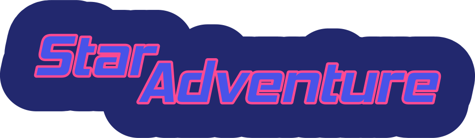

# [Your Game Title]

>📝 **NOTE:** This is a template project from the [Godot Starter](https://github.com/TopScales/godot_starter) repository. For more information on how to begin working with this template, refer to the corresponding [documentation](docs/starter/godot_starter).

>📝 **NOTE:** Keep only the information that is relevant to your project. Remove all unnecessary documentation and notes (including this one).

>📝 NOTE: Replace the links below with badges relevant to your project. You can safely remove the links if you prefer not to use badges.

<p align="center"> <!-- Example badges -->    </p>

A brief description of your game. Write a short paragraph summarizing the core concept and what makes your game unique. Avoid using bullet points here.

>📝 **NOTE:** Add a showcase image. You can start with just a simple logo, or an early screenshot.

<p align="center">
  
</p>

*A one-sentence presentation of your game, optionally relating to the image above.*

## 🛠️ Getting Started

To begin working on this project, follow the steps below:

>📝 **NOTE:** Choose one of the options for editing the project.

[Easiest standard way]
- Download the **Godot 4.5.1** editor from the official [Godot website](https://downloads.godotengine.org/?version=4.5.1&flavor=stable&slug=win64.exe.zip&platform=windows.64)
- Clone the project: `git clone git@github.com:TopScales/godot_starter.git`
- Open the project using the editor

[Custom Editor Using VSCode]

- Clone the project `git clone git@github.com:TopScales/godot_starter.git`
- Update all submodules `git submodule update --init`
- Check out the correct Godot editor branch for your project
- Copy the content of the `misc/vscode` folder into a new `.vscode` folder
- Compile the editor using one of the available VSCode tasks: press <kbd>Ctrl</kbd>+<kbd>Shift</kbd>+<kbd>B</kbd> and select `Build Custom Editor` or `Build Custom Editor (DEBUG)`
- Run the editor from VScode via **Run and Debug** in the activity bar, then press the play button.

## 🖼️ Overview

To keep the project organized, different types of files are stored in dedicated folders. The project follows the structure illustrated below.

>📝 **NOTE:** Choose a file structure that fits your project and enforce it consistently throughout development.

```{.yaml .no-copy}
root/
│
├── addons/             # Addons and tools used for the project
├── assets/
│   ├── icons/
│   │   ├── classes/    # Editor-only class icons
│   │   └── system/     # System icons used in the game
│   ├── meshes/         # 3D objects meshes
│   ├── materials/      # All materials, including 3D object materials
│   ├── textures/       # Textures and images
│   └── sounds/         # Sound assets
├── data/               # Game data
├── docs/               # Documentation
├── godot/              # Godot source used for this project and additional modules
├── libs/               # GDExtension libraries
├── misc/               # Miscellaneous files (e.g., VSCode-specific files)
├── scenes/             # Game scenes and scripts
├── tests/              # Scenes and scripts for testing various modules
├── LICENSE             # License file
├── mkdocs.yml          # MkDocs configuration
├── project.godot       # Godot project file
├── README.md           # Project README
└── version.tres        # Version file
```

### Scenes and Assets

Scenes and assets should not be stored in the same folders. Each has its own dedicated structure. Keeping them separate helps in avoiding cluttering and makes assets easier to reuse across multiple scenes.

### Documentation

All documentation related to the game and its development is stored in the `docs` folder. See the [index file](docs/index.md) for instructions on how to generate the documentation locally or where to access it online.

## 🤝 Guidelines

Please follow these guidelines while working on the project. Having consistent naming conventions and code style helps maintain clarity and improves collaboration.

Use *snake_case* for all file and folder names. Avoid using whitespace. This ensures clarity and prevents cross-platform issues related to case sensitivity.

For GDScript, follow the official [style guide](https://docs.godotengine.org/en/latest/tutorials/scripting/gdscript/gdscript_styleguide.html).
For C++ modules and libraries, follow Godot’s [code style](https://contributing.godotengine.org/en/latest/engine/guidelines/code_style.html).
(Third-party libraries may use their own style conventions.)

During development, regularly test the modules you are working on to maintain quality.
For GDScript modules, use [GUT](https://gut.readthedocs.io/en/v9.5.0/) for unit testing.
For C++ modules, create [unit tests](https://docs.godotengine.org/en/stable/engine_details/architecture/unit_testing.html) following Godot’s documentation.

## 🛎️ Support

For any question related to the project contact the corresponding area manager.

- **Project Lead**: Person 1 person1@contact.com
- **Programming Lead**: Person 2 person2@contact.com
- **Game Design Lead**: Person 3 person3@contact.com
- **Art Lead**: Person 4 person4@contact.com

## 🚀 Deploying the game

>📝 **NOTE:** Add instructions on how to deploy the game for testing. It is usually better to link to separate documents.

*This section can be completed later.*

## 🪪 License

>📝 **NOTE:** AAdd the license that best fits your project. If this is a private project, remove the [LICENSE](LICENSE) file from the root directory.

Distributed under the [MIT license](https://opensource.org/license/MIT).
