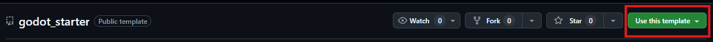

# Godot Starter Template

Use this project as a template for your own Godot game. In the template [repository](https://github.com/TopScales/godot_starter), at the top, you will find the option to create a new repository using it as a template (see image below). Click the green button, select the `Create a new repository` options, and fill the required information.

## Custom Godot Editor

- Why should you use a custom editor
- Steps to get the editor ready

## Features

- Change scenes
- Build UI from script
- Common debug options
- Common settings options

## TODO

- Custom logger
- Error handling

## How to Update from original branch

Show warning: only merge from original template if you know what your doing. Better to update individual files

Add remote
- git remote add base_game git@github.com:TopScales/godot_starter.git
- git fetch base_game

- Create new branch
- git checkout -b <update_base_game_branch>

git pull base_game master --allow-unrelated-histories
git submodule update --init